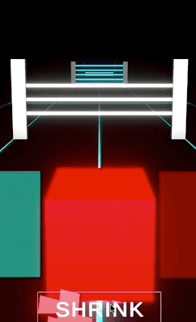

# Pavlin Edrev's Portfolio

---

 
<link rel="stylesheet" href="css/used_tech.css">

---

## Description 
This is an overview of most of my programming projects since 2015. 
Documenting each project takes a lot of time, but all will be uploaded soon.
Programming is just one of my many hobbies. I have created every project purely for fun and learning purposes only.

---

## Unity (C#)

**Projects Overview:**

- Arena Shape Shooter (Coming soon...)
> Shoot down waves of enemies in an arena.


- Balance (Coming soon...)
> Balance a ball through challenging levels and obstacles.


- ZigZag (mobile) (Coming soon...)
> Challenge yourself by zig-zagging and avoid falling off the platform.


- RPG Idle Collector (mobile) (Coming soon...)
> Endlessly upgrade your collector and see it transform.


- Color Switch Dash
>  
> **Description:** See how long you can go by jumping over, going under, switching colors, and going through obstacles.


---

## PowerShell 

**Projects Overview:**

- Handy Menu (Coming soon...)
> A menu with useful tools to use as an IT Supporter.

- Handy Menu v2 (Coming soon...)
> A menu with hotfixes and other tools to use as an IT Supporter.

- Slot machine (Coming soon...)
> Spin the slot machine and see if you win!

- Free From School Timer (Coming soon...)
> A simple clock that tells you how much time you have until school finishes.

---

## C++ + CMD

**Projects Overview:**

- Survival game (Coming soon...)
> A survival game where you need to survive as long as you can by taking life-depending decisions.

---

## Arduino (C++)

**Projects Overview:**

- Reveal a Secret Message (Coming soon...)
> Press a button and reveal the Secret message - created this one to surprise my girlfriend for Valentine's Day.

- Arpeggio piano (Coming soon...)
> Become a professional piano player... sort of... not really.

---

## Other

**Projects Overview:**

- Custom shortcuts for work (AutoHotkey) (Coming soon...)
> I scripted a few custom shortcuts to make my work as an IT Supporter at LEGO quicker and more efficient.

- Life statistics (Google Sheets) (Coming soon...)
> Make an overview of the satisfaction in every area of your life and compare it to the previous month.

- Monthly Reading Tracker (Google Sheets) (Coming soon...)
> Track how much time you've read a book this month.


```
01001000 01100101 01101100 01101100 01101111 00100000 01100110 01100101 01101100 01101100 01101111 01110111 00100000 01001001 01010100 00100000 01110000 01100101 01110010 01110011 01101111 01101110 00100001 00100000 00111010 00101001
```
<!-- <span class="circle">[See Project](site_pages/Unity.md)</span> -->
