# Pavlin Edrev's Portfolio

---

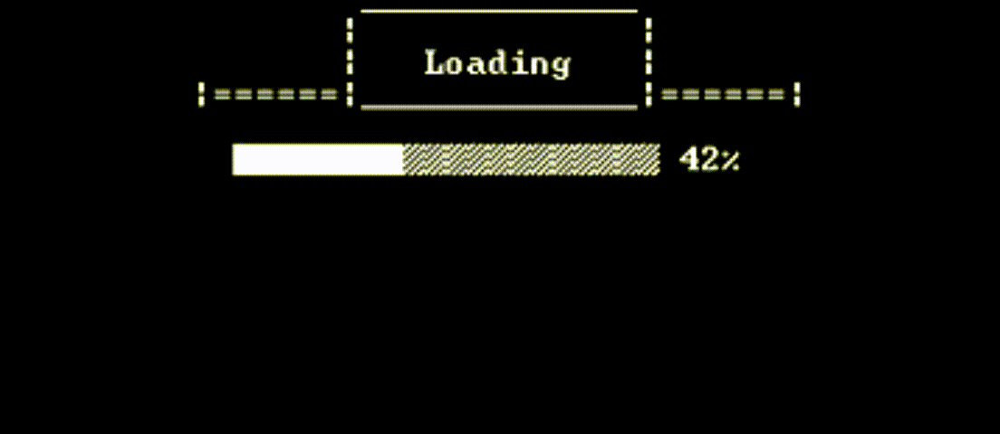 
<link rel="stylesheet" href="css/used_tech.css">

---

## Description 
This is an overview of some of my programming projects since 2015.  
All of the projects have been done with immense passion, countless hours of debugging, and letting my creativity run free to achieve success, perfection, and complete fulfillment—satisfaction and even tears of happiness.  
By gamifying my projects, I dig deep into the logic behind each dynamic to understand, learn, and keep my love for programming alive, making learning new languages more exciting and every success incredibly rewarding and fulfilling.

---
## TIA Portal v19 - PLC & HMI (LD)

**Projects Overview:**

- Snake Game
>   
>
> (uploading preview soon)
> 
> Already in the first semester of my education without any previous experience I tested the limits of the 1215C CPU and KTP700 Basic HMI using Ladder logic and recreated the classical Snake game. It features difficulty modes, levels and multiplayer mode between two HMIs and PLCs using Get/Put commands. 
>
> My inspiration for recreating this game was brought up the nostalgic moments of my childhood of me playing Snake on my Gameboy. The fact that there was no tutorials/videos/documentation on the internet about someone achieving this in TIA using Ladder Logic made this project extra challenging, but also extremely satisfactory in the end.


- 2 Player Whack-a-Mole Game
>   
>
> Using only one PLC and two HMIs to create a game where your reflexes are put to the test. Two players compete in tapping as many moles as possible within one minute to define the winner.
>
> The art is created in paint and inspired by Pokemon - one of my favorite animations I used to watch as a child. The inspiration for creating the game came from playing a real Whack-a-Mole on a date I had recently with my girlfriend.


- Box Washer Prototype
>   
>
> (uploading preview soon)
> 
> As a finishing first-semester project, I had to create a program and design an HMI for a customer's prototype Box Washer. It features six different screens with advanced animations, timers, and indicators. I felt a great sense of accomplishment after drawing the 2D model for the machine, designing the HMI screens and programming the logic - completely from scratch.
>
> The freedom to create everything from scratch by letting my imagination and creativity run freely, made the completion of this project deeply fulfilling when I saw all parts working together as a whole. 


- FESTO Stations - Sorting and Processing 
>   
>
> (uploading preview soon)
> 
> As a finishing second-semester project, I had to learn how the two stations work, troubleshoot, and modify their code so they can communicate and work together and design an HMI. The HMI makes it possible to manually interact with each component on the Station, as well as, seeing all the processes live under both stations' automatic operation.
> 
> Being given a task to understand an unknown machine without any guidance was challenging, but it was exactly what made me feel a deep sense of accomplishment once I figured it out.

---

## Thonny (Python)

**Projects Overview:**

- Pico Go Robot
>   
>
> (uploading preview soon)
> 
> More info soon.

---

## Unity (C#)

**Projects Overview:**

- **Color Switch Dash**
>  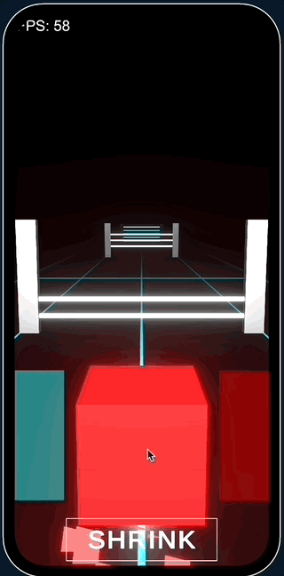 
> 
> **Description:** See how long you can go by jumping over, going under, switching colors, and going through obstacles. 
> 
> I have always wanted to create a mobile game ever since I was a kid. I finally accomplished that and the kid in me is crying happy tears now.


- ZigZag
> 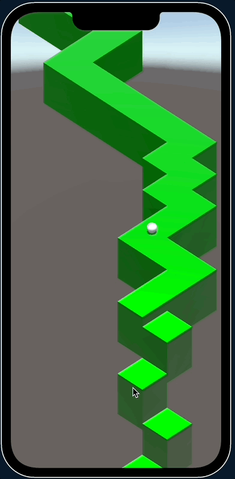 
>
> **Description:** Challenge yourself by zig-zagging and avoid falling off the platform.
> 
> Being one of the most popular games in the AppStore and looking pretty simple, I decided to challenge myself and recreate it. Finishing this game, inspired me to do more projects in the iOS environment.


- Arena Shape Shooter
> 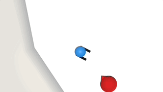 
> 
> Shoot down waves of enemies in an arena.
> 
> After playing for many hours on diep.io with my friends, I decided to challenge myself and make my own version of it.


- Balance
> 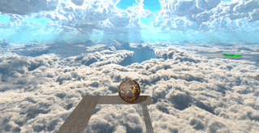 
> 
> Balance a ball through challenging levels and obstacles.
> 
> When I was a kid, I used to watch my parents play the famous game "Balance" back in the early 2000s, so I've got inspired to recreate it and make my own style and levels.


- Immersive Game Menu
> 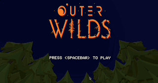 
> 
> Inspired by my passion for survival games and my favorite game Outer Wilds, I created a survival environment and made a menu that uses it for more immersiveness.
> 
> It might not look like much, but when I finished this project and added the music, it brought up tears in my eyes.


- RPG Idle Collector
> 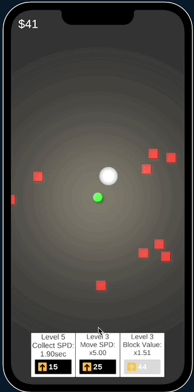 
> 
> Upgrade your collector and see how fast you can make it.
> 
> This type of game was on top of the charts when I got inspired to recreate it. I had a deep urge to break down the logic and understand it on a deeper level - and so I did!

---

## CMD (C++)

**Projects Overview:**

- Survival game
>  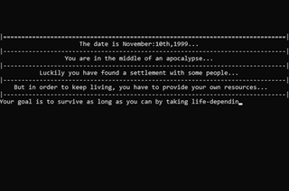 
>
> A survival game where you need to survive as long as you can by taking life-depending decisions. It features custom made sounds, animations and ASCII art
> 
> This game was the BEGINNING of my programming journey back in 2015. I have no words to describe how many times I've got goosebumps by getting an imaginative idea, planning it, and succesfully programming it inside the game to turn it into a reality. Truly my favorite project of them all!


- Puzzle game
> 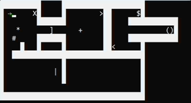 
>
> Move objects, collect keys, solve puzzles, and open doors to reach the next level without getting stuck.
> 
> Challenging myself to move a player model inside the console (CMD) and interacting with objects was my first introduction to creating 2D graphics and games.


---

## PowerShell 

**Projects Overview:**

- Slot machine
> 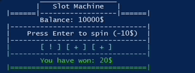 
> 
> Just spin and see if you win!
> 
> One of the projects from school to visualise my classmates how casinos eventually steal all your money.


- Digital Free From School Timer
> 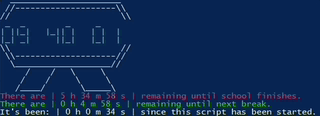 
> 
> A simple digital timer that tells you how much time you have until school finishes or your next break.
> 
> When I used to go to primary school I had a classmate who didn't have a watch, so he was constantly asking me how much time there is left until the end of school. There you go Philip!

- Handy Menu
> 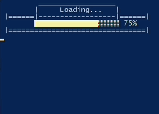 
> 
> A menu with useful tools to use as an IT Supporter.
> 
> Making it easier to navigate a few scripts when you have a menu instead. This was my first introduction to GUI in Powershell.

---

## Arduino (C++)

**Projects Overview:**

- Reveal a Secret Message
>  
> 
> Press a button and reveal the Secret message.
> 
> I created this to surprise my girlfriend for Valentine's Day. I love you Elvira!

- Arpeggio piano
>  
> 
> Become a professional piano player... sort of... not really.
> 
> My roomie used to say I sing bad. Now he says I sing and play piano bad...

---

## Flutter (Dart)

**Projects Overview:**

_To be uploaded soon..._

## Other

**Projects Overview:**

- Life statistics (Google Sheets)
> 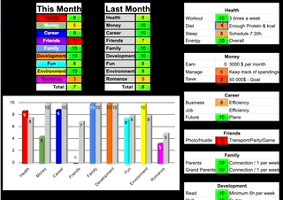 
> 
> Make an overview of the satisfaction in every area of your life and compare it to the previous month.
> 
> Back when I was going hard-core on my personal development journey, I wanted to see how I am doing in all the different aspect of my life, so I created this overview that boosted my results x10!

- Monthly Reading Tracker (Google Sheets)
> 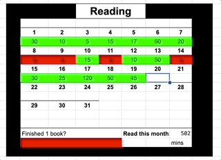 
> 
> Track how much time you've read a book this month.
> 
> I love reading books! I had close people who did not beliving how much I read - this proved them wrong.

- Custom shortcuts for work (AutoHotkey)
> I scripted a few custom shortcuts to make my work as an IT Supporter quicker and more efficient.
>
> While my collegues were wasting time trying to find every tool they needed, I was super efficiently doing my woork without any interuptions and saving time both for myself and the clients I was supporting.

 

```
01001000 01100101 01101100 01101100 01101111 00100000 01100110 01100101 01101100 01101100 01101111 01110111 00100000 01001001 01010100 00100000 01110000 01100101 01110010 01110011 01101111 01101110 00100001 00100000 00111010 00101001
```
<!-- <span class="circle">[See Project](site_pages/Unity.md)</span> -->
