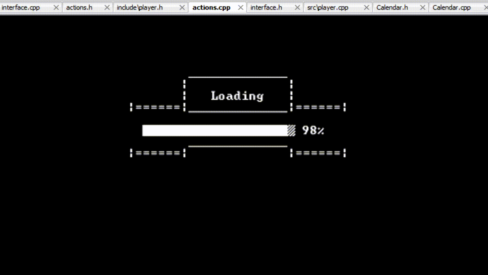

# Portfolio
This is Pavlin Edrev's programming portfolio. Here you will find all my programming projects.
 
---
## Preface 

朋友们，很高兴在这里相遇！我是刘杰文，来自中国，目前还是一名学生。我加入 Github 已经至少有6年了，近期开发水平正在快速提高，也开始尝试将更多的想法付诸实践。在这里，在这个自由社区，我希望能与大家共建一个更加友好、美好的的未来。如果你有什么有趣的想法，欢迎来和我分享。

<link rel="stylesheet" href="css/used_tech.css">

---

## Unity

**Projects Overview:**

- Survival Menu

- iOS Jumper

[See All Unity Projects Here](site_pages/Unity.md)

---

## PowerShell 

- Menu
Simething is here
- Level 2

  

---
## C++

IconFold
: Repository: *[IconFold](https://github.com/LiuJiewenTT/IconFold)*。使用这套工具，可以方便地提取文件夹使用的自定义图标，也可以以不同的方式给文件夹应用或取消应用自定义图标。图标可以是你希望的任何有效的 *.ico* 文件。使用到的技术: *batch*。
