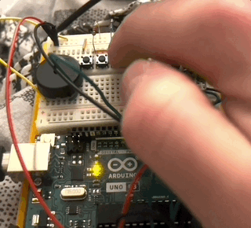

# Pavlin Edrev's Portfolio

---

 
<link rel="stylesheet" href="css/used_tech.css">

---

## Description 
This is an overview of some of my programming projects since 2015.
All of the projects have been done with immense passion and countless hours of debugging to achieve perfection.
By gamifying my projects, I keep my love for programming alive, making learning new languages more exciting and every success incredibly rewarding.

---
## TIA Portal v19 - PLC & HMI (LD)

**Projects Overview:**

- Snake Game
>   
>
> (uploading preview soon)
> Already in the first semester of my education without any previous experience I tested the limits of the 1215C CPU and KTP700 Basic HMI using Ladder logic and recreated the classical Snake game. It features difficulty modes, levels and multiplayer mode between two HMIs and PLCs using Get/Put commands. 


- 2 Player Whack-a-Mole Game
>   
>
> Using only one PLC and two HMI to create a game where your reflexes are put to the test. Two players compete in tapping as many moles as possible within one minute to define the winner.


- Box Washer
>   
>
> (uploading preview soon)
> As a finishing first-semester project, I had to create a program and design an HMI for a customer's prototype Box Washer. It features six different screens with advanced animations, timers, and indicators.


- FESTO Stations - Sorting and Processing 
>   
>
> (uploading preview soon)
> As a finishing second-semester project, I had to learn how the two stations work, troubleshoot, and modify their code so they can communicate and work together and design an HMI. The HMI makes it possible to manually interact with each component on the Station, as well as, seeing all the processes live under both stations' automatic operation.

---

## Thonny (Python)

**Projects Overview:**

- Pico Go Robot
>   
>
> (uploading preview soon)
> More info soon.

---

## Unity (C#)

**Projects Overview:**

- **Color Switch Dash**
>   
> 
> **Description:** See how long you can go by jumping over, going under, switching colors, and going through obstacles.


- ZigZag
>  
>
> **Description:** Challenge yourself by zig-zagging and avoid falling off the platform.


- Arena Shape Shooter
>  
> 
> Shoot down waves of enemies in an arena.


- Balance
>  
> 
> Balance a ball through challenging levels and obstacles.


- Immersive Game Menu
>  
> 
> Inspired by my passion for survival games and my favorite game Outer Wilds, I created a survival environment and made a menu that uses it for more immersiveness.


- RPG Idle Collector
>  
> 
> Upgrade your collector and see how fast you can make it.

---

## CMD (C++)

**Projects Overview:**

- Survival game
>   
>
> A survival game where you need to survive as long as you can by taking life-depending decisions.

- Puzzle game
>  
>
> Move objects, collect keys, solve puzzles, and open doors to reach the next level without getting stuck.

---

## PowerShell 

**Projects Overview:**

- Slot machine
>  
> 
> Just spin and see if you win!

- Digital Free From School Timer
>  
> 
> A simple digital timer that tells you how much time you have until school finishes or your next break.

- Handy Menu
>  
> 
> A menu with useful tools to use as an IT Supporter.

---

## Arduino (C++)

**Projects Overview:**

- Reveal a Secret Message
>  
> 
> Press a button and reveal the Secret message - this one was created to surprise my girlfriend for Valentine's Day.

- Arpeggio piano
>  
> 
> Become a professional piano player... sort of... not really.

---

## Flutter (Dart)

**Projects Overview:**

_To be uploaded soon..._

## Other

**Projects Overview:**

- Life statistics (Google Sheets)
>  
> 
> Make an overview of the satisfaction in every area of your life and compare it to the previous month.

- Monthly Reading Tracker (Google Sheets)
>  
> 
> Track how much time you've read a book this month.

- Custom shortcuts for work (AutoHotkey)
> I scripted a few custom shortcuts to make my work as an IT Supporter quicker and more efficient.

```
01001000 01100101 01101100 01101100 01101111 00100000 01100110 01100101 01101100 01101100 01101111 01110111 00100000 01001001 01010100 00100000 01110000 01100101 01110010 01110011 01101111 01101110 00100001 00100000 00111010 00101001
```
<!-- <span class="circle">[See Project](site_pages/Unity.md)</span> -->
