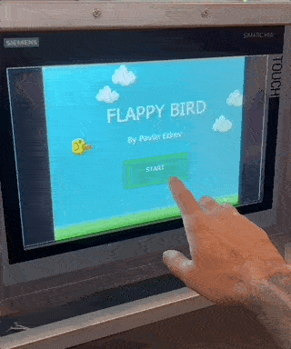
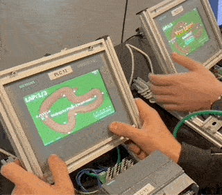
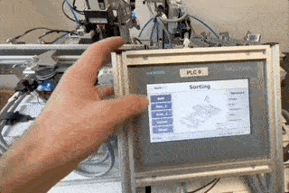
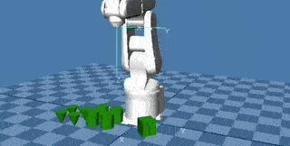
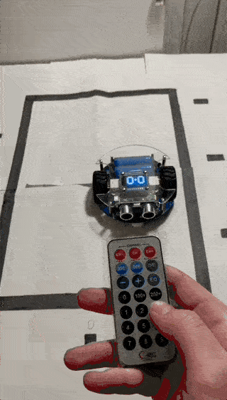
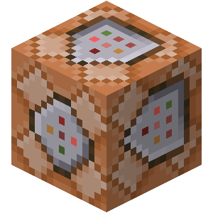

# Pavlin Edrev's Portfolio

---

 
<link rel="stylesheet" href="css/used_tech.css">

---

## Description 
This is an overview of some of my programming projects since 2015.  

All of the projects have been done with immense passion, countless hours of debugging, and letting my creativity run free to achieve success, perfection, complete fulfillment, satisfaction, and even tears of happiness.  

By gamifying my projects, I dig deep into the logic behind each dynamic to understand, learn, and keep my love for programming alive, making learning new languages more exciting and every success incredibly rewarding and fulfilling.

---
## TIA Portal v19 - PLC & HMI (LD)

**Projects Overview:**

- **Snake Game**
>   
> 
> In the first semester of my education, without any previous experience, I tested the limits of the Siemens 1215C PLC and KTP700 Basic HMI using Ladder logic and recreated the classical Snake game. It features difficulty modes, levels, and multiplayer mode between two HMIs and two PLCs using Get/Put commands. 
> 
> I was inspired to recreate this game by nostalgic childhood memories of playing Snake on my Game Boy. The fact that there were no tutorials/videos/documentation on the internet about someone achieving this in TIA using Ladder Logic made this project extra challenging, but also extremely fulfilling in the end.

- **Flappy Bird Game**
>  
> 
> Having to build the physics, the collisions, and the logic of the movements and animations from scratch was super fun. The game features a few obstacles and is completely library-conformant, set up to easily scale with additional obstacles, different settings, more levels, and possibly more players.
> 
> I still remember how much frustration and anger this game brought, not only to me, but to millions of people around the world back when it got released in 2013. Recently, I got curious if I could make a mock-up version in TIA Portal V19, and the answer was "YES!".

- **2-Player Rally Race Game**
>  
> 
> All the knowledge gained throughout the second semester of my education has been used here - structure, scaling, and library conformance were the primary focus to achieve a satisfactory outcome in this project. It runs on one Siemens 1215C PLC and two separate KTP700 HMIs, and it features easy integration of new race tracks, single-player, difficulty modes, custom settings, and even more players!
> 
> My huge passion for racing video games got me the idea for this game, and my big curiosity about "Is it actually possible to do this on an HMI?" inspired me to put a lot of hours into making collisions, physics, controls, and a graphically pleasing art style from scratch, all of which brought this game into reality.

- **2 Player Whack-a-Mole Game**
>   
>
> <div id="bottle_filling"></div>
>
> Using only one Siemens 1215C PLC and two KTP700 HMIs to create a game where your reflexes are put to the test. Two players compete in tapping as many moles as possible within one minute to define the winner.
>
> The art is created in paint and inspired by Pokémon, one of my favorite animations I used to watch as a child. The inspiration for creating the game came from playing a real Whack-a-Mole on a date I recently had with my girlfriend.

- **Bottle Filling Prototype**
>  
> 
> As a finishing second-semester project, I had to create a PLC program and design an HMI for a company that wanted to incorporate a bottle-filling machine with future scaling in mind. The HMI features a clean interface according to industry standards with cleverly organised menus, submenus, pop-ups, alarms, and user-friendly controls. The PLC program is structured with many function blocks, data blocks, custom data types, and folders, making it fully library-conformant and easily scaled.
>
> Without using the <a href="#robot_arm_project"> DENSO robotarm to depalletize, scan, move, sort, and palletize the different bottle types, </a> and good communication between the PLCs, this project wouldn't have been completed. It was super interesting and fun to combine and make a simulation of these two machines, making me feel like I am one step closer to the real industry world.

- **Box Washer Prototype**
>   
> 
> As a finishing first-semester project, I had to create a program and design an HMI for a customer's prototype Box Washer. It features six different screens with advanced animations, timers, and indicators. I felt a great sense of accomplishment after drawing the 2D model for the machine, designing the HMI screens, and programming the logic, completely from scratch.
>
> The freedom to create everything from scratch by letting my imagination and creativity run freely made the completion of this project deeply fulfilling when I saw all parts working together as a whole. 

- **FESTO Stations - Distribution and Sorting**
>  
> 
> As part of a school project, I had to make these two stations communicate well with each other and work together in harmony to make them as efficient and fast as possible. They feature a queue system, alarms, and a simple and user-friendly HMI screen for process overview and manual operation of each component.
> 
> Taking a simple project such as this one and making it as efficient as possible was not an easy task, but it was super fun to troubleshoot one step at a time and learn from my mistakes along the way until I finally achieved my goal.

- **FESTO Stations - Sorting and Processing**
>   
> 
> <div id="robot_arm_project"></div
>
> As part of a school project, I had to learn how the two stations work, troubleshoot, and modify their code so they can communicate and work together, and design an HMI. The HMI makes it possible to interact with each component on the Station manually, as well as see all the processes live under both stations' automatic operation. The two stations communicate using GET/PUT commands.
> 
> Being given a task to understand an unknown machine without any guidance was challenging, but it was exactly what made me feel a deep sense of accomplishment once I figured it out.

---

## WINCAPS III (PAC)

**Projects Overview:**

- **Advanced Depalletising and Paletising**
>   
> 
> As part of the <a href="#bottle_filling"> second-semester projects </a>, I had to program a DENSO robot arm to depalletize a random size bottle, move it in front of an RFID scanner to identify its size, put it into a bottle filling machine until filled, sort the bottle according to its size, and then palletize the different sort of bottles on top of each other to create a pallet. 
> 
> This project uses a lot of communication between the robot and <a href="#bottle_filling"> the main bottle-filling machine program </a> to make everything work in harmony, and it was super fun to make.  


- **Simple Pick and Place**
>   
> 
> The robot arm picks up two blocks and puts them on top of each other, and then puts them back. It simulates palletizing and depalletizing items in the automation industry.
> 
> Getting into PAC Script for the first time ever, I created this simple program to learn the basics of the language and be able to program the robot arm most efficiently.

---

## Thonny (Python)

**Projects Overview:**

- **Warehouse Worker Prototype**
>   
> 
> Using the PicoGo v2 robot and manipulating almost all of its sensors with Python, I made a prototype for it to be the perfect warehouse worker, or a Roomba if you attach a vacuum to it... 
> 
> It features line tracking, obstacle avoidance and both manual and automatic modes. Using the manual mode, you can assign a station using the remote control, and the robot will get to that station, deload, and return to the starting station. Using Automatic mode, you just press start on the remote and it assigns a random station to go to, then it returns to the starting station, and it does the same thing over and over again, until the battery dies or you stop it.


- **Self Playing Snake game**
>   
> 
> Using a little 1.14-inch LCD, Raspberry Pi Pico, Python, and the lack of buttons pushed me in the direction to make the Snake game play on its own. It works well as an entertaining screensaver.
> 
> Right after creating the snake game for PLC (Further up in the portfolio), I thought I would challenge myself to make it in Python too. Due to the lack of buttons on the PicoGo robot, I had to make it play on its own. I could technically use its IR sensors to control the snake.


---

## Unity (C#)

**Projects Overview:**

- **Color Switch Dash**
>   
> 
> **Description:** See how long you can go by jumping over, going under, switching colors, and going through obstacles. 
> 
> I have always wanted to create a mobile game ever since I was a kid. I finally accomplished that, and the kid in me is feeling super proud now.


- **ZigZag**
>  
>
> **Description:** Challenge yourself by zig-zagging and avoid falling off the platform.
> 
> Being one of the most popular games in the App Store and looking pretty simple, I decided to challenge myself and recreate it. Finishing this game inspired me to do more projects in the iOS environment.


- **Arena Shape Shooter**
>  
> 
> **Description:** Shoot down waves of enemies in an arena.
> 
> After playing for many hours on diep.io with my friends, I decided to challenge myself and make my own version of it.


- **Balance**
>  
> 
> **Description:** Balance a ball through challenging levels and obstacles.
> 
> When I was a kid, I used to watch my parents play the famous game "Balance" back in the early 2000s, so I got inspired to recreate it and make my own style and levels.


- **Immersive Game Menu**
>  
> 
> **Description:** Inspired by my passion for survival games and my favorite game Outer Wilds, I created a survival environment and made a menu that uses it for more immersion.
> 
> It might not look like much, but when I finished this project and added the music, it made me emotional.


- **RPG Idle Collector**
>  
> 
> **Description:** Upgrade your collector and see how fast you can make it.
> 
> This type of game was on top of the charts when I got inspired to recreate it. I had a deep urge to break down the logic and understand it on a deeper level - and so I did!

---

## CMD (C++)

**Projects Overview:**

- **Survival game**
>   
>
> **Description:** A survival game where you need to survive as long as you can by making life-depending decisions. It features custom-made sounds, animations, and ASCII art
> 
> This game was the BEGINNING of my programming journey back in 2015. I have no words to describe how many times I've got goosebumps by getting an imaginative idea, planning it, and successfully programming it inside the game to turn it into a reality. Truly my favorite project of them all!


- **Puzzle game**
>  
>
> **Description:** Move objects, collect keys, solve puzzles, and open doors to reach the next level without getting stuck.
> 
> Challenging myself to move a player model inside the console (CMD) and interacting with objects was my first introduction to creating 2D graphics and games.


---

## PowerShell 

**Projects Overview:**

- **Slot machine**
>  
> 
> **Description:** Just spin and see if you win!
> 
> One of the projects from school was to visualize for my classmates how casinos eventually steal all their customers' money.


- **Digital Free From School Timer**
>  
> 
> **Description:** A simple digital timer that tells you how much time you have until school finishes or your next break.
> 
> When I used to go to primary school, I had a classmate who didn't have a watch, so he was constantly asking me how much time there was left until the end of school. There you go, Phillip!

- **Handy Menu**
>  
> 
> **Description:** A menu with useful tools to use as an IT Supporter.
> 
> Making it easier to navigate a few scripts when you have a menu instead. This was my first introduction to GUI in PowerShell.

---

## Arduino (C++)

**Projects Overview:**

- **Reveal a Secret Message**
>  
> 
> **Description:** Press a button and reveal the Secret message.
> 
> I created this to surprise my girlfriend for Valentine's Day. I love you, Elvira!

- **Arpeggio piano**
>  
> 
> **Description:** Become a professional piano player... sort of... not really.
> 
> My roommate used to say I sing badly. Now he says I sing AND play piano badly...

---

## Flutter (Dart)

**Projects Overview:**

_To be uploaded soon..._

## Other

**Projects Overview:**

- **Minecraft Battle Royale (Command Blocks)**
>  
> 
> **Description:** Get thrown on an island with countless of other players, gather gear, and fight your way against other players through the shrinking zone to become the last player standing.
> 
> I had to create a LAN Party project that could involve the whole school. I decided to create a Minecraft server, and instead of using traditional mods, I decided to create the whole Battler Royale game from scratch using only Command blocks inside Minecraft. The project was endorsed and enjoyed by everyone(around 100 people) who joined the server.

- **WordPress Websites (HTML/CSS)** 
> **Description:** Allows you to find out more about me, my dating story, and the services that I offer in my Dating business.
> 
> Using WordPress, Elementor Plugin, HTML, and CSS, I created two websites to improve the reach of my dating business so more people can learn about the services I provide.

- **Life statistics (Google Sheets)**
>  
> 
> **Description:** Make an overview of the satisfaction in every area of your life and compare it to the previous month.
> 
> Back when I was going hard-core on my personal development journey, I wanted to see how I was doing in all the different aspects of my life, so I created this overview that boosted my results x10!

- **Monthly Reading Tracker (Google Sheets)**
>  
> 
> **Description:** Track how much time you've read a book this month.
> 
> I love reading books! I had close people who did not believe how much I read - this proved them wrong.

- **Custom shortcuts for work (AutoHotkey)**
> **Description:** I scripted a few custom shortcuts to make my work as an IT Supporter quicker and more efficient.
>
> While my colleagues were wasting time trying to find every tool they needed, I was working super efficiently without any interruptions and saving time both for myself and the clients I was supporting.

 

```
01001000 01100101 01101100 01101100 01101111 00100000 01100110 01100101 01101100 01101100 01101111 01110111 00100000 01001001 01010100 00100000 01110000 01100101 01110010 01110011 01101111 01101110 00100001 00100000 00111010 00101001
```
<!-- <span class="circle">[See Project](site_pages/Unity.md)</span> -->
